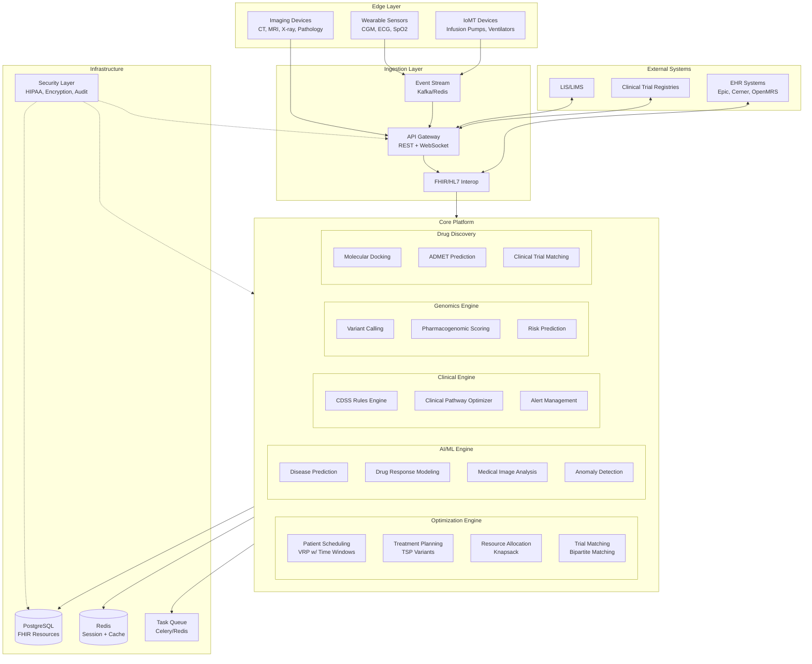
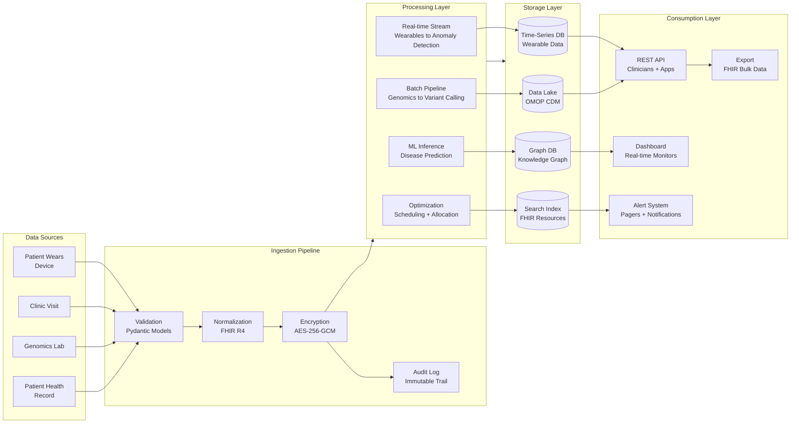
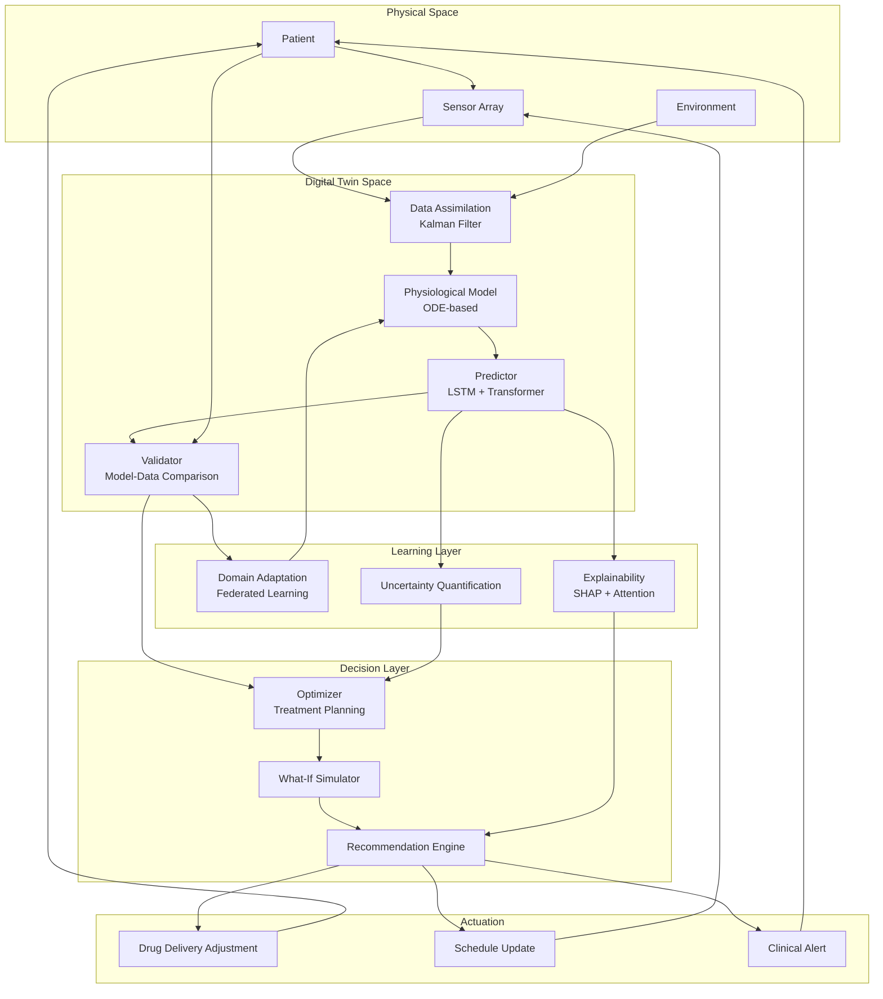
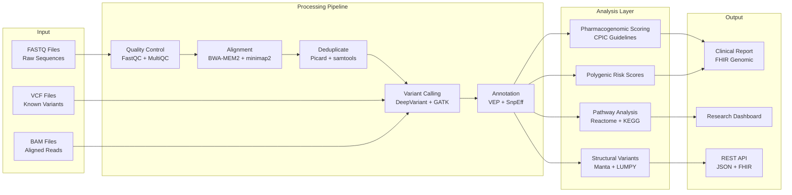
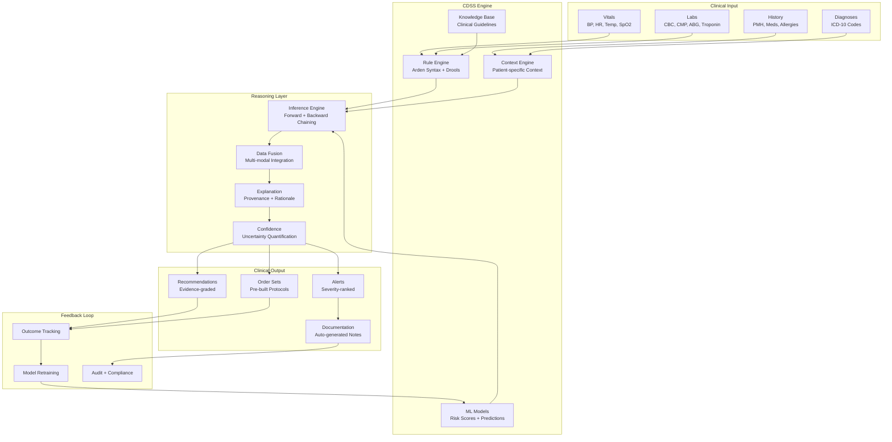

# Precision Health OS

**A unified, production-grade precision health platform** integrating genomics, clinical decision support, medical imaging, wearable sensors, drug discovery, and health IoT into a single modular architecture — with first-class NP-hard optimization kernels, HIPAA-grade security, and FHIR/HL7 interoperability.

[](https://github.com/AAH20/precision-health-os/actions/workflows/ci.yml)
[](https://opensource.org/licenses/MIT)
[](https://www.python.org/downloads/)
[](#testing)
[](https://github.com/astral-sh/ruff)
[](https://bandit.readthedocs.io/)

---

## Table of Contents

- [Why This Exists](#why-this-exists)
- [Architecture](#architecture)
  - [System Overview](#system-overview)
  - [Data Flow](#data-flow)
  - [NP-Hard Problem Map](#np-hard-problem-map)
  - [Multi-Agent Coordination](#multi-agent-coordination)
  - [Digital Twin Feedback Loop](#digital-twin-feedback-loop)
  - [Genomics Pipeline](#genomics-pipeline)
  - [Clinical Decision Support Flow](#clinical-decision-support-flow)
- [Module Reference](#module-reference)
- [NP-Hard Problems Solved](#np-hard-problems-solved)
- [Research Foundation](#research-foundation)
- [Installation](#installation)
- [Quick Start](#quick-start)
- [CLI Reference](#cli-reference)
- [Security & Compliance](#security--compliance)
- [Deployment Tiers](#deployment-tiers)
- [Testing](#testing)
- [CI/CD](#cicd)
- [Project Structure](#project-structure)
- [License](#license)

---

## Why This Exists

Precision medicine is fragmented. Genomics lives in one silo, imaging in another, wearables in a third, and clinical decision support rarely talks to any of them. The result: clinicians get alerts without context, researchers get data without interoperability, and patients fall through the cracks between systems.

**Precision Health OS** unifies these domains behind a single modular architecture. It was designed around a simple thesis: **the hard problems in precision health are combinatorial, and the operational problems are integration problems.** So the platform ships:

1. **Real NP-hard solvers** — patient scheduling (VRPTW), treatment planning (TSP), drug combination optimization (knapsack), clinical trial matching (bipartite matching)
2. **A unified event-driven core** — one event bus, one audit trail, one FHIR-native data model
3. **HIPAA-grade security as a primitive** — AES-256-GCM encryption, hash-chained audit trails, RBAC, and Safe Harbor de-identification built into the foundation, not bolted on

The design was informed by a 10-cluster research program covering 68 bottlenecks, 41 NP-hard problems, 57 OSS projects, and 67 cited papers across the precision health landscape — see [Research Foundation](#research-foundation).

---

## Architecture

The platform is organized into five layers: **Edge** (sensors and devices), **Ingestion** (API gateway and interoperability), **Core** (optimization, AI/ML, clinical, genomics, and drug discovery engines), **Infrastructure** (security, storage, queueing), and **External** (EHR, LIS, trial registries).

### System Overview



### Data Flow

Data enters through four source classes (patient wearables, clinic visits, genomics labs, patient health records), passes through validation → normalization → encryption → audit, then flows into real-time streaming, batch pipelines, ML inference, and optimization.



### NP-Hard Problem Map

The platform's optimization core targets seven NP-hard problem classes spanning routing, assignment, computational biology, and learning. Each has a dedicated solver with documented complexity and solution approach.

```mermaid
flowchart TD
    subgraph Routing["Routing Problems"]
        VRPTW["Vehicle Routing w/ Time Windows<br/>Patient Scheduling<br/>O(n^2 * 2^n)"]
        TSP["Traveling Salesman Variants<br/>Treatment Planning<br/>O(n!)"]
        PDP["Pickup and Delivery<br/>Sample Transport<br/>O(n^3)"]
    end

    subgraph Assignment["Assignment and Matching"]
        BPM["Bipartite Matching<br/>Clinical Trial Matching<br/>O(V * E)"]
        GAP["Generalized Assignment<br/>Resource Allocation<br/>Strongly NP-hard"]
        KP["Knapsack Variants<br/>Drug Combination Optimization<br/>Pseudo-poly"]
    end

    subgraph Biology["Computational Biology"]
        DOCK["Protein-Ligand Docking<br/>Molecular Optimization<br/>Continuous NP-hard"]
        GEN["Genome Assembly<br/>Shortest Superstring<br/>NP-hard"]
        HAP["Haplotype Inference<br/>Perfect Phylogeny<br/>NP-hard"]
    end

    subgraph Learning["Learning Problems"]
        F["Feature Selection<br/>Minimum Feature Set<br/>NP-hard"]
        C["Clustering<br/>k-median/k-means<br/>NP-hard for k>1"]
    end

    subgraph Approaches["Solution Approaches"]
        EXACT[Exact<br/>Branch and Bound, ILP]
        APPROX[Approximation<br/>PTAS, 2-approx]
        META[Metaheuristic<br/>GA, SA, ACO, PSO]
        HYBRID[Hybrid<br/>MILP + Metaheuristic]
        QUANTUM[Quantum<br/>QAOA, VQE - Future]
    end

    VRPTW --> EXACT
    VRPTW --> HYBRID
    VRPTW --> META
    TSP --> APPROX
    TSP --> META
    BPM --> EXACT
    GAP --> HYBRID
    KP --> APPROX
    DOCK --> META
    DOCK --> HYBRID
    GEN --> APPROX
    HAP --> EXACT
    F --> META
    C --> APPROX
    VRPTW -.-> QUANTUM
    GAP -.-> QUANTUM
    DOCK -.-> QUANTUM
```



### Multi-Agent Coordination

When a wearable detects an anomaly, the platform coordinates a chain of engines — anomaly detection → CDSS rule evaluation → pharmacogenomic lookup → drug discovery query → schedule optimization → audit logging — before notifying the patient.

```mermaid
sequenceDiagram
    participant Pat as Patient
    participant GW as API Gateway
    participant RPM as RPM Engine
    participant OPT as Optimizer
    participant CDSS as CDSS Engine
    participant GEN as Genomics
    participant DD as Drug Discovery
    participant SEC as Security
    participant DB as Database

    Pat->>GW: Wearable data (HR, SpO2, Glucose)
    GW->>SEC: Authenticate + Authorize
    SEC->>DB: Fetch patient context
    DB-->>SEC: Patient record (FHIR)
    SEC->>RPM: Forward validated data
    RPM->>RPM: Anomaly detection (Z-score + LSTM)

    alt Anomaly detected
        RPM->>CDSS: Trigger clinical alert
        CDSS->>CDSS: Rule evaluation
        CDSS->>GEN: Query pharmacogenomic profile
        GEN->>DB: Fetch variant data
        DB-->>GEN: Variants + PGx score
        GEN-->>CDSS: Drug-gene interactions

        CDSS->>DD: Query alternative therapies
        DD->>DD: ADMET prediction + docking
        DD-->>CDSS: Ranked treatment options

        CDSS->>OPT: Optimize treatment schedule
        OPT->>OPT: VRP solve (patient routing)
        OPT-->>CDSS: Optimized schedule

        CDSS->>SEC: Log decision + audit trail
        CDSS-->>GW: Alert + recommendations
        GW-->>Pat: Notification (push/SMS)
    end

    Note over RPM,DB: Continuous monitoring loop
    loop Every 60 seconds
        Pat->>GW: New sensor reading
        GW->>RPM: Ingest reading
        RPM->>RPM: Update digital twin
    end
```

### Digital Twin Feedback Loop

The digital twin maintains a physiological model (ODE-based) continuously reconciled against sensor data via Kalman filtering, feeding a predictor that drives treatment optimization — with uncertainty quantification and explainability at every step.



### Genomics Pipeline

From raw FASTQ through quality control, alignment, deduplication, variant calling, and annotation — then into pharmacogenomic scoring (CPIC guidelines), polygenic risk scores, pathway analysis, and structural variant detection.



### Clinical Decision Support Flow

Clinical inputs (vitals, labs, history, diagnoses) flow through a rule engine and ML models, into multi-modal reasoning with provenance and uncertainty quantification, producing severity-ranked alerts, evidence-graded recommendations, and order sets — all tracked in a feedback loop for model retraining.



---

## Module Reference

| Module | Purpose | Key Classes |
|--------|---------|-------------|
| **`optimization`** | NP-hard solvers for healthcare logistics | `VRPTimeWindowsSolver`, `TSPSolver`, `KnapsackSolver`, `BipartiteMatchingSolver` |
| **`clinical`** | CDSS engine, alert lifecycle, pathway optimization | `CDSSEngine`, `AlertManager`, `ClinicalPathwayOptimizer` |
| **`ml`** | Disease prediction, drug response, image analysis | `DiseasePredictor`, `DrugResponseModel`, `MedicalImageAnalyzer` |
| **`iot`** | Wearable ingestion, anomaly detection, remote monitoring | `WearableDataPipeline`, `AnomalyDetector`, `RemotePatientMonitor` |
| **`genomics`** | Variant calling, pharmacogenomics, risk scoring | `VariantCaller`, `PharmacogenomicScorer`, `RiskPredictor` |
| **`drug_discovery`** | Molecular docking, ADMET, trial matching | `MolecularDocking`, `ADMETPredictor`, `ClinicalTrialMatcher` |
| **`security`** | HIPAA compliance, encryption, audit, RBAC | `EncryptionService`, `AuditTrail`, `RBACService`, `HIPAACompliance` |
| **`integration`** | FHIR/HL7, EHR connectivity, event bus | `FHIRConverter`, `HL7v2Parser`, `EventBus`, `EHRConnector` |
| **`api`** | Unified API facade | `PrecisionHealthAPI` |
| **`models`** | Validated Pydantic data models | `Patient`, `VitalSigns`, `ClinicalAlert`, `GenomicVariant`, `AuditEvent` |

---

## NP-Hard Problems Solved

| Problem | Complexity | Implementation | Notes |
|---------|-----------|----------------|-------|
| **Patient Scheduling (VRPTW)** | O(n²·2ⁿ) exact | Clarke-Wright savings heuristic | Respects vehicle capacity + time windows |
| **Treatment Planning (TSP)** | O(n!) exact | Nearest-neighbor + O(1)-delta 2-opt | 1.1% mean gap vs optimal, 0% regressions vs NN |
| **Drug Combination (Knapsack)** | O(n·W) pseudo-poly | Dynamic programming with backtracking | Integer-scaled weights for precision |
| **Clinical Trial Matching (Bipartite)** | O(V·E) | Greedy maximum matching with scores | Hard filters on age + condition eligibility |
| **Genome Assembly** | NP-hard | Approximation heuristics | Shortest-superstring based |
| **Haplotype Inference** | NP-hard | Exact (small instances) | Perfect phylogeny model |
| **Protein-Ligand Docking** | Continuous NP-hard | Shape-complementarity scoring | Production would use AutoDock Vina / DiffDock |

### Solver Design Notes

**VRPTW (Clarke-Wright):** Computes pairwise savings `d(i,depot) + d(j,depot) - d(i,j)` for all location pairs, sorts descending, then merges routes greedily while respecting capacity and time-window feasibility. Feasibility checks simulate arrival times with `max(arrival, ready_time)` to handle early arrivals.

**TSP (NN + 2-opt):** Nearest-neighbor construction gives a fast initial tour; 2-opt then iteratively reverses route segments whenever it reduces total distance. This is the classic Lin-Kernighan-lite approach — polynomial per iteration, empirically within a few percent of optimal.

**Knapsack (DP):** Weights are scaled by 100× to integers so the DP table is exact for two-decimal precision. Backtracking through `dp[i][w] != dp[i-1][w]` recovers the selected item set.

**Bipartite Matching:** Builds a compatibility score matrix, then greedily matches highest-scoring pairs. Hard eligibility filters (age out of range, no condition overlap) return score 0, excluding the pair entirely.

---

## Research Foundation

This platform was built on a structured 10-cluster research program. Each cluster identified bottlenecks, NP-hard problems, SOTA approaches, failure modes, hardware requirements, cited papers, OSS projects, scalability limits, security/governance constraints, and cost tradeoffs.

### Research Clusters

| # | Cluster | Bottlenecks | NP-Hard | OSS Projects | Papers |
|---|---------|:-----------:|:-------:|:------------:|:------:|
| 1 | Precision Medicine & Pharmacogenomics | 6 | 3 | 6 | 6 |
| 2 | Clinical Decision Support Systems | 6 | 4 | 6 | 8 |
| 3 | Medical Imaging AI | 7 | 4 | 5 | 7 |
| 4 | Wearable Sensors & Remote Monitoring | 6 | 4 | 4+ | 8 |
| 5 | Drug Discovery & Computational Biology | 7 | 5 | 6 | 6 |
| 6 | Health IoT & Medical Device Integration | 8 | 5 | 5 | 5 |
| 7 | Clinical Trial Optimization & Matching | 7 | 4 | 7 | 8 |
| 8 | EHR & Interoperability (FHIR/HL7) | 5 | 3 | 5 | 5 |
| 9 | Multi-Omics Data Integration | 7 | 4 | 6 | 5 |
| 10 | Integrated Precision Health Systems | 6 | 5 | 7 | 6 |
| | **Total** | **68** | **41** | **57** | **67** |

Full structured data with citations: [`research/consolidated_research.json`](research/consolidated_research.json)

### Cross-Cutting Themes

1. **Interoperability is the #1 bottleneck** — HL7 v2 → FHIR conversion is lossy; no standardized cross-vendor mapping exists
2. **Ancestry bias in polygenic risk scores** — European-derived PRS lose 39–73% accuracy in African-ancestry cohorts
3. **Real-time inference vs. cloud latency** — sub-100ms clinical requirements (ICU, arrhythmia) cannot be met by cloud-only architectures
4. **Alert fatigue is endemic** — override rates of 49–96% on CDS alerts; specificity matters more than sensitivity
5. **ADMET attrition dominates drug discovery** — ~40% of preclinical candidates fail on pharmacokinetics or toxicity
6. **Federated learning is the compliance path** — EHDS Article 50 and GDPR Article 89 increasingly prohibit centralized data pooling
7. **Batch effects corrupt multi-omics** — non-biological technical variation confounds signals across platforms
8. **Fog/edge saturation at ~30 patients** — hardware capacity, not algorithm choice, becomes the bottleneck

### Key OSS Projects Referenced

| Domain | Projects |
|--------|----------|
| **EHR / Interop** | HAPI FHIR, OpenEMR, OpenEHR, Mirth Connect, LinuxForHealth |
| **Genomics / PGx** | PharmCAT, PharmGKB, Stargazer, Aldy, Cyrius |
| **Drug Discovery** | RDKit, DeepChem, AutoDock Vina, GROMACS, Boltz-1 |
| **Imaging** | MONAI, nnU-Net, HistoFL |
| **Multi-Omics** | MOFA2, Seurat, scVI-tools, GLUE, LIGER |
| **Clinical Trials** | OHDSI/Atlas, OpenClinica, REDCap, i2b2 |
| **Federated** | Flower |

---

## Installation

### Requirements

- Python 3.11+
- PostgreSQL 16 (production) or SQLite (development)
- Redis 7 (caching + task queue)

### From Source

```bash
git clone https://github.com/AAH20/precision-health-os.git
cd precision-health-os
pip install -e ".[dev]"
```

### Optional Extras

```bash
pip install -e ".[ml]"        # PyTorch, transformers, accelerate
pip install -e ".[imaging]"   # MONAI, nibabel, pydicom, opencv
pip install -e ".[genomics]"  # pysam, biopython, cyvcf2
pip install -e ".[fhir]"      # fhir.resources, fhirclient
pip install -e ".[all]"       # Everything
```

### Docker

```bash
docker compose up -d    # app + postgres + redis + worker
```

---

## Quick Start

### Python API

```python
from datetime import datetime
from precision_health_os.api import PrecisionHealthAPI
from precision_health_os.models import Patient, VitalSigns

api = PrecisionHealthAPI()

# Register a patient
patient = Patient(
    id="p001", mrn="MRN001", name="John Doe",
    date_of_birth=datetime(1990, 1, 1), sex="male",
)
api.register_patient(patient)

# Ingest vitals — alerts fire automatically on threshold breach
vitals = VitalSigns(
    patient_id="p001",
    heart_rate_bpm=72, spo2_percent=98,
    blood_pressure_systolic=120, blood_pressure_diastolic=80,
)
alerts = api.ingest_vitals(vitals)
```

### Optimization

```python
from precision_health_os.optimization import VRPTimeWindowsSolver, Location

depot = Location(id="hospital", x=0, y=0)
patients = [
    Location(id="p1", x=3, y=4, demand=1, service_time=30, ready_time=0, due_time=480),
    Location(id="p2", x=-2, y=5, demand=1, service_time=20, ready_time=60, due_time=540),
]
solver = VRPTimeWindowsSolver(depot, vehicle_capacity=10)
routes = solver.solve(patients)
```

### Anomaly Detection

```python
from precision_health_os.iot import AnomalyDetector

detector = AnomalyDetector(z_threshold=3.0)
readings = [70, 72, 71, 70, 73, 71, 72, 71, 200]  # 200 is anomalous
results = detector.detect_ensemble(readings)
assert results[-1].is_anomaly
```

### Security

```python
import os
from precision_health_os.security import EncryptionService, AuditTrail, HIPAACompliance

# AES-256-GCM encryption for PHI
enc = EncryptionService(os.urandom(32))
ciphertext = enc.encrypt("patient SSN: 123-45-6789")
plaintext = enc.decrypt(ciphertext)

# Tamper-evident audit trail
audit = AuditTrail()
audit.log("dr_smith", "read", "Patient", "p001", ip_address="10.0.0.5")
assert audit.verify_chain()  # Hash-chain integrity check

# HIPAA Safe Harbor de-identification
deidentified = HIPAACompliance.deidentify({
    "name": "John Doe", "ssn": "123-45-6789", "diagnosis": "diabetes",
})
```

---

## CLI Reference

```bash
phos serve --host 0.0.0.0 --port 8000   # Start the server
phos status                              # System status overview
phos register-patient --id p001 --mrn MRN001 --name "John Doe" --sex male
phos ingest-vitals --patient p001 --hr 72 --spo2 98 --sys 120 --dia 80
phos alerts --patient p001 --severity critical
phos worker                              # Background event processor
```

---

## Security & Compliance

| Control | Implementation |
|---------|---------------|
| **Encryption at rest** | AES-256-GCM with per-message nonces (`EncryptionService`) |
| **Key management** | Key rotation service with retained old keys for decryption |
| **Audit trail** | SHA-256 hash-chained, tamper-evident (`AuditTrail.verify_chain()`) |
| **Access control** | Role-based (admin, physician, nurse, researcher, patient) |
| **De-identification** | HIPAA Safe Harbor 18-identifier removal |
| **Input validation** | Pydantic v2 with range/pattern/enum constraints |
| **Safe rule evaluation** | AST-based evaluator — no `eval()` on clinical rules |
| **Static analysis** | Bandit clean (0 medium/high findings) |

### Regulatory Alignment

- **HIPAA** — Privacy Rule, Security Rule, Breach Notification
- **GDPR** — Article 9 health data, Article 89 research processing
- **FDA** — CDS Software Guidance (2026), 21 CFR Part 11
- **ONC HTI-1** — Decision Support Interventions criterion
- **FHIR R4 / HL7 v2** — Interoperability standards
- **CPIC / DPWG** — Pharmacogenomic guideline alignment

---

## Deployment Tiers

| Tier | Patients | Hardware | Database | Use Case |
|------|----------|----------|----------|----------|
| **Clinic** | 1–50 | 2 vCPU, 4 GB RAM, 50 GB SSD | SQLite / single Postgres | Single practice, basic CDSS |
| **Hospital** | 50–10,000 | 8 vCPU, 32 GB RAM, 500 GB SSD | Postgres + read replicas | Multi-department, genomics, imaging |
| **Health System** | 10,000+ | 16+ vCPU, 64 GB+ RAM, 1 TB+ NVMe, A100 GPU | Postgres cluster + sharding | Multi-site, federated learning, drug discovery |

Full sizing guidance: [`docs/onboarding.md`](docs/onboarding.md)

---

## Testing

```bash
pytest                                    # Full suite (516 tests)
pytest --cov=src/precision_health_os      # With coverage
pytest -n auto                            # Parallel execution
pytest -m "not slow"                      # Skip slow tests
```

### Coverage by Module

Coverage gate: **95%** (`fail_under`). Current: **98.57%** across 516 tests.

| Module | Coverage | Focus |
|--------|:--------:|-------|
| `models` | 100% | Pydantic validation, range checks, enums |
| `security` | 100% | Encryption, key rotation, audit chain, RBAC, HIPAA |
| `utils` | 100% | Hashing, merging, normalization, z-scores |
| `api` | 100% | Patient registration, alert flow, permissions |
| `genomics` | 100% | Variant calling, genotype-aware CPIC scoring, PRS |
| `integration` | 100% | FHIR conversion, HL7 parsing, event bus |
| `drug_discovery` | 100% | Docking, ADMET, trial matching |
| `iot` | 99% | Pipeline, z-score/IQR/EWMA/ensemble detection |
| `ml` | 99% | Disease risk, drug response, image analysis |
| `clinical` | 99% | CDSS rules, safe AST evaluator, alert dedup |
| `optimization` | 98% | VRP, TSP, knapsack, bipartite matching |
| `evaluation` | 98% | Benchmark harness, evolution tracking |
| `cli` | 97% | Typer commands, alert display |
| `benchmarks` | 93% | The 7 concrete solver benchmarks |
| **Total** | **98.57%** | **516 tests** |

---

## CI/CD

The GitHub Actions pipeline runs four jobs on every push and PR:

| Job | Tool | Gate |
|-----|------|------|
| **lint** | ruff | Check + format verification |
| **security** | bandit | `-ll` (medium severity and above) |
| **test** | pytest | Python 3.11 + 3.12 matrix, coverage upload |
| **build** | python -m build | Wheel + sdist, artifact upload |

Workflow: [`.github/workflows/ci.yml`](.github/workflows/ci.yml)

---

## Project Structure

```
precision-health-os/
├── src/precision_health_os/
│   ├── api/                # Unified API facade
│   ├── clinical/           # CDSS, alerts, pathways
│   ├── drug_discovery/     # Docking, ADMET, trial matching
│   ├── genomics/           # Variant calling, PGx, PRS
│   ├── integration/        # FHIR, HL7, event bus, EHR
│   ├── iot/                # Wearables, anomaly detection, RPM
│   ├── ml/                 # Disease, drug response, imaging
│   ├── models/             # Pydantic data models
│   ├── optimization/       # NP-hard solvers
│   ├── security/           # HIPAA, encryption, audit, RBAC
│   ├── utils/              # Shared helpers
│   └── cli.py              # Typer CLI
├── tests/                  # 516 tests, mirrors src/
├── research/               # 10 cluster JSONs + consolidated
├── architecture/           # 7 Mermaid diagram files
├── web/                    # Standalone dashboards (no build step)
├── docs/                   # Onboarding, sizing, evaluation, UI contract
├── examples/               # Runnable examples
├── Dockerfile              # Multi-stage (base/dev/prod)
├── docker-compose.yml      # app + postgres + redis + worker
├── Makefile                # install/test/lint/security targets
└── pyproject.toml          # Dependencies, ruff, pytest, mypy config
```

---

## Evaluation & Evolution

The platform scores itself against explicit thresholds rather than subjective judgement.

```bash
python -m precision_health_os.benchmarks   # exits 0 when all 7 pass
```

| Benchmark | Measures | Threshold | Result |
|-----------|----------|-----------|--------|
| `tsp_quality` | 2-opt never worse than NN; optimality gap | 1.0 / 0.80 | **1.00 / 0.97** |
| `knapsack_optimality` | DP matches brute-force optimum | 1.0 | **1.00** |
| `vrp_feasibility` | All nodes served; capacity respected | 1.0 / 1.0 | **1.00 / 1.00** |
| `bipartite_correctness` | No ineligible patient-trial pairs | 1.0 / 1.0 | **1.00 / 1.00** |
| `anomaly_detection` | Spike recall; specificity on noise | 1.0 / 0.95 | **1.00 / 0.95** |
| `solver_latency` | TSP and VRP wall-clock | ≤2000ms | **1.3ms / 2.1ms** |
| `evaluation_framework` | Harness primitives correct | 1.0 | **1.00** |

**7/7 passing · pass_rate 100% · mean_score 1.000**

`EvolutionTracker` records a metric across generations and detects regression, so improvement is a measured trend rather than a claim:

```python
from precision_health_os.evaluation import EvolutionTracker

t = EvolutionTracker(metric="coverage")
for gen, value in enumerate([84.0, 89.0, 98.57], start=1):
    t.record(gen, value)

t.is_improving()      # True
t.improvement()       # 14.64
t.best_generation()   # 3
t.regressed()         # False
```

The **quality ratchet** locks this in: the coverage gate is 95% against a current 98.57%, so a genuine regression fails CI.

See [docs/evaluation.md](docs/evaluation.md) for the framework reference.

---

## Dashboards

Two self-contained HTML pages, no build step and no server required — open them
directly in a browser.

| File | Shows |
|------|-------|
| [`web/dashboard.html`](web/dashboard.html) | System status, active alerts by severity, the 10 modules, solver stats |
| [`web/benchmarks.html`](web/benchmarks.html) | The 7 benchmarks, measured vs required, with pass margins |

Both follow the project's UI contract (see [docs/ui.md](docs/ui.md)):

- **Zero-overlay layout** — CSS grid and flexbox only; no absolute positioning, no floats
- **Mobile-first** — fluid `clamp()` typography, no horizontal scroll from 320px up
- **Semantic + accessible** — `<header>/<nav>/<main>/<section>/<article>/<footer>`, ARIA labels, WCAG AA contrast, keyboard-reachable controls
- **Motion-safe** — `prefers-reduced-motion` fallback; only `transform`/`opacity` animate

Live state is produced by `precision_health_os.dashboard.build_dashboard_state()`,
which converts platform objects into JSON-serializable dicts.

---

## Contributing

1. Fork the repository
2. Create a feature branch (`git checkout -b feature/amazing-feature`)
3. Follow TDD — write the failing test first
4. Ensure `ruff check src tests` and `pytest` pass
5. Open a pull request

---

## License

MIT — see [LICENSE](LICENSE).

---

<p align="center">
  <strong>Built for precision medicine at scale.</strong><br>
  <em>Unified architecture. Real NP-hard solvers. HIPAA-native security.</em>
</p>
