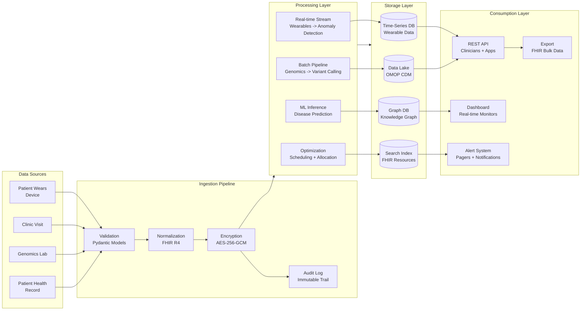

# Data Flow Architecture

```mermaid
flowchart LR
    subgraph Sources["Data Sources"]
        P[Patient Wears<br/>Device]
        C[Clinic Visit]
        G[Genomics Lab]
        PHR[Patient Health<br/>Record]
    end

    subgraph Ingestion["Ingestion Pipeline"]
        V[Validation<br/>Pydantic Models]
        N[Normalization<br/>FHIR R4]
        E[Encryption<br/>AES-256-GCM]
        A[Audit Log<br/>Immutable Trail]
    end

    subgraph Processing["Processing Layer"]
        RT[Real-time Stream<br/>Wearables -> Anomaly Detection]
        BT[Batch Pipeline<br/>Genomics -> Variant Calling]
        ML[ML Inference<br/>Disease Prediction]
        OPT[Optimization<br/>Scheduling + Allocation]
    end

    subgraph Storage["Storage Layer"]
        TSDB[(Time-Series DB<br/>Wearable Data)]
        GRAPH[(Graph DB<br/>Knowledge Graph)]
        LAKE[(Data Lake<br/>OMOP CDM)]
        SEARCH[(Search Index<br/>FHIR Resources)]
    end

    subgraph Consumption["Consumption Layer"]
        API[REST API<br/>Clinicians + Apps]
        DASH[Dashboard<br/>Real-time Monitors]
        ALERT[Alert System<br/>Pagers + Notifications]
        EXP[Export<br/>FHIR Bulk Data]
    end

    P --> V
    C --> V
    G --> V
    PHR --> V
    V --> N
    N --> E
    E --> A
    E --> Processing
    RT --> TSDB
    BT --> LAKE
    ML --> GRAPH
    OPT --> SEARCH
    Processing --> Storage
    TSDB --> API
    LAKE --> API
    GRAPH --> DASH
    SEARCH --> ALERT
    API --> EXP
```
