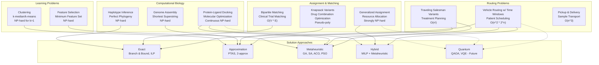

# NP-Hard Problem Map

```mermaid
flowchart TD
    subgraph Routing["Routing Problems"]
        VRPTW["Vehicle Routing w/ Time Windows<br/>Patient Scheduling<br/>O(n^2 * 2^n)"]
        TSP["Traveling Salesman Variants<br/>Treatment Planning<br/>O(n!)"]
        PDP["Pickup & Delivery<br/>Sample Transport<br/>O(n^3)"]
    end

    subgraph Assignment["Assignment & Matching"]
        BPM["Bipartite Matching<br/>Clinical Trial Matching<br/>O(V * E)"]
        GAP["Generalized Assignment<br/>Resource Allocation<br/>Strongly NP-hard"]
        KP["Knapsack Variants<br/>Drug Combination Optimization<br/>Pseudo-poly"]
    end

    subgraph Biology["Computational Biology"]
        DOCK["Protein-Ligand Docking<br/>Molecular Optimization<br/>Continuous NP-hard"]
        GEN["Genome Assembly<br/>Shortest Superstring<br/>NP-hard"]
        HAP["Haplotype Inference<br/>Perfect Phylogeny<br/>NP-hard"]
    end

    subgraph Learning["Learning Problems"]
        F["Feature Selection<br/>Minimum Feature Set<br/>NP-hard"]
        C["Clustering<br/>k-median/k-means<br/>NP-hard for k>1"]
    end

    subgraph Approaches["Solution Approaches"]
        EXACT[Exact<br/>Branch & Bound, ILP]
        APPROX[Approximation<br/>PTAS, 2-approx]
        META[Metaheuristic<br/>GA, SA, ACO, PSO]
        HYBRID[Hybrid<br/>MILP + Metaheuristic]
        QUANTUM[Quantum<br/>QAOA, VQE - Future]
    end

    VRPTW --> EXACT
    VRPTW --> HYBRID
    VRPTW --> META
    TSP --> APPROX
    TSP --> META
    BPM --> EXACT
    GAP --> HYBRID
    KP --> APPROX
    DOCK --> META
    DOCK --> HYBRID
    GEN --> APPROX
    HAP --> EXACT
    F --> META
    C --> APPROX
    VRPTW -.-> QUANTUM
    GAP -.-> QUANTUM
    DOCK -.-> QUANTUM
```
