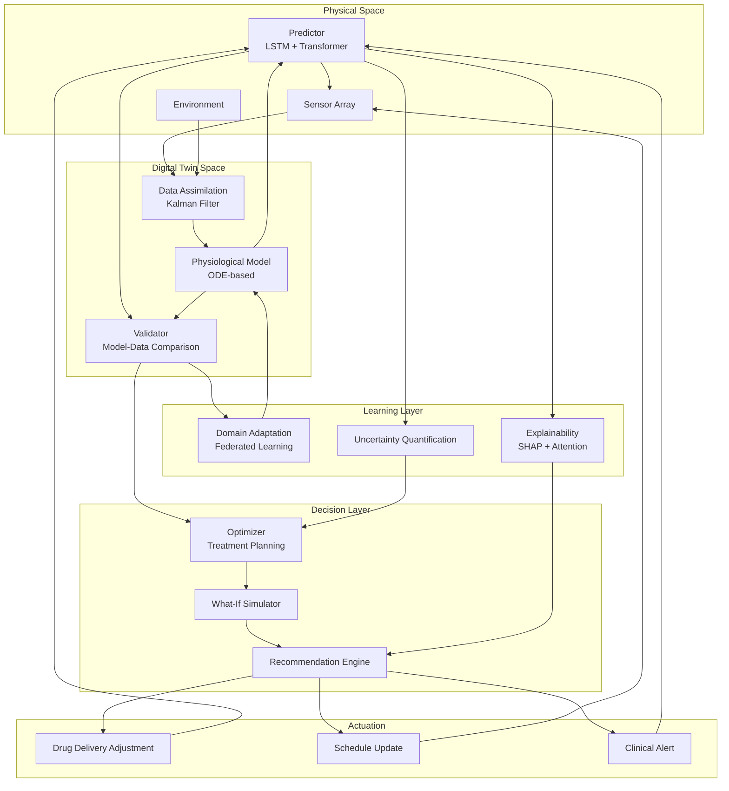

# Digital Twin Feedback Loop

```mermaid
flowchart TB
    subgraph Physical["Physical Space"]
        P[Patient]
        S[Sensor Array]
        E[Environment]
    end

    subgraph Digital["Digital Twin Space"]
        M[Physiological Model<br/>ODE-based]
        D[Data Assimilation<br/>Kalman Filter]
        P[Predictor<br/>LSTM + Transformer]
        V[Validator<br/>Model-Data Comparison]
    end

    subgraph Decision["Decision Layer"]
        OPT[Optimizer<br/>Treatment Planning]
        SIM[What-If Simulator]
        REC[Recommendation Engine]
    end

    subgraph Learning["Learning Layer"]
        DR[Domain Adaptation<br/>Federated Learning]
        UL[Uncertainty Quantification]
        EX[Explainability<br/>SHAP + Attention]
    end

    subgraph Actuation["Actuation"]
        DR2[Drug Delivery Adjustment]
        SCH[Schedule Update]
        ALERT[Clinical Alert]
    end

    P --> S
    S --> D
    E --> D
    D --> M
    M --> P
    P --> V
    M --> V
    V --> OPT
    OPT --> SIM
    SIM --> REC
    REC --> DR2
    REC --> SCH
    REC --> ALERT
    DR2 --> P
    SCH --> S
    ALERT --> P
    V --> DR
    DR --> M
    P --> UL
    UL --> OPT
    P --> EX
    EX --> REC
```
