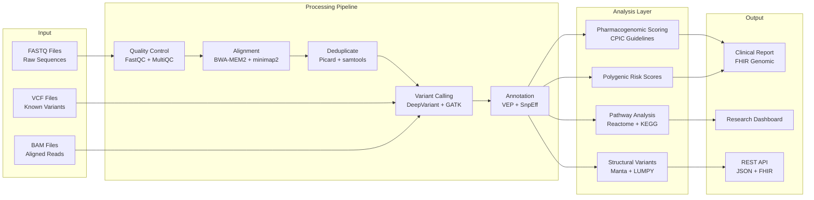

# Genomics Pipeline Flow

```mermaid
flowchart LR
    subgraph Input["Input"]
        FASTQ[FASTQ Files<br/>Raw Sequences]
        VCF[VCF Files<br/>Known Variants]
        BAM[BAM Files<br/>Aligned Reads]
    end

    subgraph Processing["Processing Pipeline"]
        QC[Quality Control<br/>FastQC + MultiQC]
        ALIGN[Alignment<br/>BWA-MEM2 + minimap2]
        DEDUP[Deduplicate<br/>Picard + samtools]
        CALL[Variant Calling<br/>DeepVariant + GATK]
        ANN[Annotation<br/>VEP + SnpEff]
    end

    subgraph Analysis["Analysis Layer"]
        PGx[Pharmacogenomic Scoring<br/>CPIC Guidelines]
        PRS[Polygenic Risk Scores]
        PATH[Pathway Analysis<br/>Reactome + KEGG]
        STR[Structural Variants<br/>Manta + LUMPY]
    end

    subgraph Output["Output"]
        REPORT[Clinical Report<br/>FHIR Genomic]
        DASH[Research Dashboard]
        API[REST API<br/>JSON + FHIR]
    end

    FASTQ --> QC
    QC --> ALIGN
    ALIGN --> DEDUP
    DEDUP --> CALL
    VCF --> CALL
    BAM --> CALL
    CALL --> ANN
    ANN --> PGx
    ANN --> PRS
    ANN --> PATH
    ANN --> STR
    PGx --> REPORT
    PRS --> REPORT
    PATH --> DASH
    STR --> API
```
