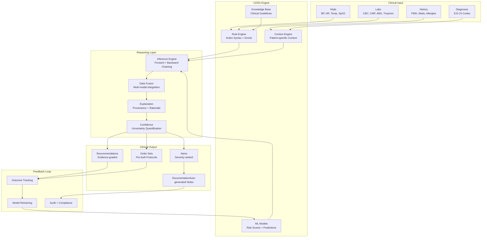

# Clinical Decision Support Flow

```mermaid
flowchart TD
    subgraph Input["Clinical Input"]
        V[Vitals<br/>BP, HR, Temp, SpO2]
        L[Labs<br/>CBC, CMP, ABG, Troponin]
        H[History<br/>PMH, Meds, Allergies]
        D[Diagnoses<br/>ICD-10 Codes]
    end

    subgraph CDSS["CDSS Engine"]
        R[Rule Engine<br/>Arden Syntax + Drools]
        KB[Knowledge Base<br/>Clinical Guidelines]
        ML[ML Models<br/>Risk Scores + Predictions]
        C[Context Engine<br/>Patient-specific Context]
    end

    subgraph Reasoning["Reasoning Layer"]
        INFER[Inference Engine<br/>Forward + Backward Chaining]
        FUSE[Data Fusion<br/>Multi-modal Integration]
        EXP[Explanation<br/>Provenance + Rationale]
        CONF[Confidence<br/>Uncertainty Quantification]
    end

    subgraph Output["Clinical Output"]
        ALERT[Alerts<br/>Severity-ranked]
        REC[Recommendations<br/>Evidence-graded]
        ORDER[Order Sets<br/>Pre-built Protocols]
        DOC[Documentation<br;->Auto-generated Notes]
    end

    subgraph Feedback["Feedback Loop"]
        OUT[Outcome Tracking]
        LEARN[Model Retraining]
        AUDIT[Audit + Compliance]
    end

    V --> R
    L --> R
    H --> C
    D --> C
    KB --> R
    ML --> INFER
    R --> INFER
    C --> INFER
    INFER --> FUSE
    FUSE --> EXP
    EXP --> CONF
    CONF --> ALERT
    CONF --> REC
    CONF --> ORDER
    ALERT --> DOC
    REC --> OUT
    ORDER --> OUT
    OUT --> LEARN
    LEARN --> ML
    DOC --> AUDIT
```
