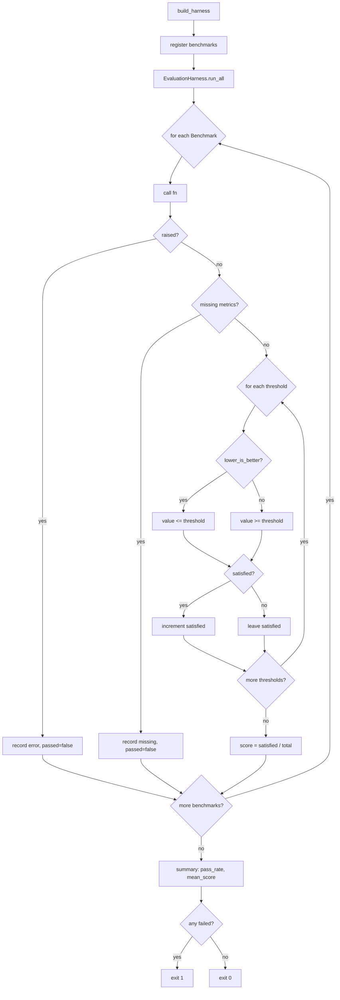

# Benchmark Suite

The benchmark suite measures the platform's real solvers against explicit
numeric thresholds, so "exceeds benchmarks" is a measured claim rather than
subjective judgement. Each benchmark exercises the actual implementation (no
mocks) and asserts a pass/fail gate per metric.

Run it locally:

```bash
python -m precision_health_os.benchmarks
```

The suite exits `0` when every benchmark passes and `1` otherwise.

## Results (live run)

Captured from `python -m precision_health_os.benchmarks` on this checkout:

| Benchmark | Metric | Measured | Required | Margin |
|---|---|---:|---:|---:|
| tsp_quality | no_regression_vs_nn | 1.0000 | 1.0 | 0.0000 |
| tsp_quality | within_10pct_of_optimal | 0.9750 | 0.80 | +0.1750 |
| knapsack_optimality | optimality_rate | 1.0000 | 1.0 | 0.0000 |
| vrp_feasibility | all_nodes_served_rate | 1.0000 | 1.0 | 0.0000 |
| vrp_feasibility | capacity_respected_rate | 1.0000 | 1.0 | 0.0000 |
| bipartite_correctness | no_ineligible_matches | 1.0000 | 1.0 | 0.0000 |
| bipartite_correctness | found_an_eligible_patient | 1.0000 | 1.0 | 0.0000 |
| anomaly_detection | spike_recall | 1.0000 | 1.0 | 0.0000 |
| anomaly_detection | normal_specificity | 0.9500 | 0.95 | +0.0000 |
| solver_latency | tsp_ms | 1.3463 | 2000.0 | 1998.6537 |
| solver_latency | vrp_ms | 2.6969 | 2000.0 | 1997.3031 |
| evaluation_framework | framework_correctness | 1.0000 | 1.0 | 0.0000 |

Aggregate: `total=7 passed=7 failed=0 pass_rate=100.00% mean_score=1.000`.

Latency margins are large because the threshold is an interactive budget
(2 s), not a tight bound; the solvers run in single-digit milliseconds.

## Per-benchmark detail

### tsp_quality

Measures the 2-opt TSP solver against two references:

- **no_regression_vs_nn** — fraction of 150 random instances (seed 1234,
  n ∈ [6, 10], uniform coordinates in [0, 100]²) where the solver's tour is
  not longer than an independent nearest-neighbour tour. The NN baseline is
  computed by a separate helper, not by the solver under test. Threshold 1.0:
  2-opt must never be worse than the greedy baseline.
- **within_10pct_of_optimal** — fraction of 40 exact-solvable instances
  (n = 6, brute-force optimum) where the solver's tour is within 10% of
  optimal. The denominator is the count of instances actually solved, not an
  assumed count. Threshold 0.80: 2-opt is a heuristic, so a small gap to
  optimal is acceptable, but it must be near-optimal on small instances.

### knapsack_optimality

Runs the DP knapsack solver on 60 random instances (seed 99, capacity
∈ [20, 60], 3–8 items, value ∈ [10, 100], weight ∈ [5, 30]) and compares the
DP result to the brute-force optimum. Threshold 1.0: an exact DP must match
brute force on every instance.

### vrp_feasibility

Runs the time-window VRP solver on 40 random instances (seed 7, 4–12 customers
in [−20, 20]², demand ∈ [5, 40], vehicle capacity 100). Two metrics:

- **all_nodes_served_rate** — every customer appears in some route.
- **capacity_respected_rate** — no route's total demand exceeds capacity.

Both thresholds 1.0: feasibility is a hard constraint, not a quality target.

### bipartite_correctness

A fixed 4-patient / 1-trial matching case. The trial requires cancer,
age ∈ [18, 70]. Only p1 (50, cancer) and p4 (30, cancer) are eligible; p2 is
too old, p3 has the wrong condition. Two metrics:

- **no_ineligible_matches** — no ineligible patient is paired.
- **found_an_eligible_patient** — at least one eligible patient is paired.

Both thresholds 1.0: eligibility violations are correctness bugs.

### anomaly_detection

Tests the ensemble anomaly detector on two series families:

- **spike_recall** — 4 series (baseline ~70 with a spike of 100/150/200/500
  appended); the last point must be flagged. Threshold 1.0.
- **normal_specificity** — 20 random normal series (seed = trial index,
  uniform noise in [−3, 3] around 70); none may be flagged. Threshold 0.95:
  allows at most one false positive out of 20.

### solver_latency

Wall-clock timing (seed 5) of the TSP solver on 25 points and the VRP solver
on 30 customers, reported in milliseconds. Both use `lower_is_better` with a
2000 ms threshold — an interactive budget, not a tight bound. These are the
only non-deterministic metrics; all others are seeded.

### evaluation_framework

Exercises the framework's own primitives: `Metric.better_than` direction
handling and `EvolutionTracker` (best_generation, is_improving, improvement)
on a 3-generation sequence [0.40, 0.60, 0.80]. Threshold 1.0: the harness
scoring the solvers must itself be correct.

## CI gate

The `evaluation` job in `.github/workflows/ci.yml` runs the suite on every
push and pull request to `main`:

```yaml
- name: Run benchmark suite
  run: python -m precision_health_os.benchmarks
- name: Verify benchmark JSON report
  run: |
    python - <<'PY'
    import json
    from precision_health_os.benchmarks import build_harness
    summary = build_harness().summary()
    print(json.dumps({k: v for k, v in summary.items() if k != "results"}, indent=2))
    assert summary["failed"] == 0
    assert summary["pass_rate"] == 1.0
    print("benchmark gate: PASS")
    PY
```

The job fails the build on any failing benchmark (non-zero exit from
`main()`) or if the JSON report shows `failed > 0` or `pass_rate < 1.0`.
The `build` job depends on `evaluation`, so a benchmark failure blocks the
release artifact.

## Adding a benchmark

1. Write a `bench_*` function returning `{metric_name: float}`.
2. Register it in `build_harness()` with explicit thresholds.

```python
def bench_my_solver() -> dict[str, float]:
    random.seed(42)
    # ... run solver, measure metric ...
    return {"my_metric": measured_value}


harness.register(
    Benchmark(
        "my_solver",
        bench_my_solver,
        {"my_metric": 0.95},  # required value
        lower_is_better={"my_metric"},  # omit if higher is better
    )
)
```

Threshold semantics: by default a metric passes when `value >= threshold`.
Pass `lower_is_better` (a set of metric names) for latency-style metrics
where `value <= threshold` is the pass condition. A benchmark passes only
when **all** its thresholds are met; the score is the fraction satisfied.

## Determinism

All benchmarks except `solver_latency` use fixed `random.seed(...)` calls and
produce identical values run to run. `solver_latency` measures wall-clock time
via `time.perf_counter()` and is inherently non-deterministic; its 2000 ms
threshold is set far above the observed single-digit-millisecond values to
absorb scheduling noise. The test
`test_harness_is_deterministic_across_runs` asserts that seeded benchmarks
produce identical verdicts across consecutive runs.

## Harness run loop


