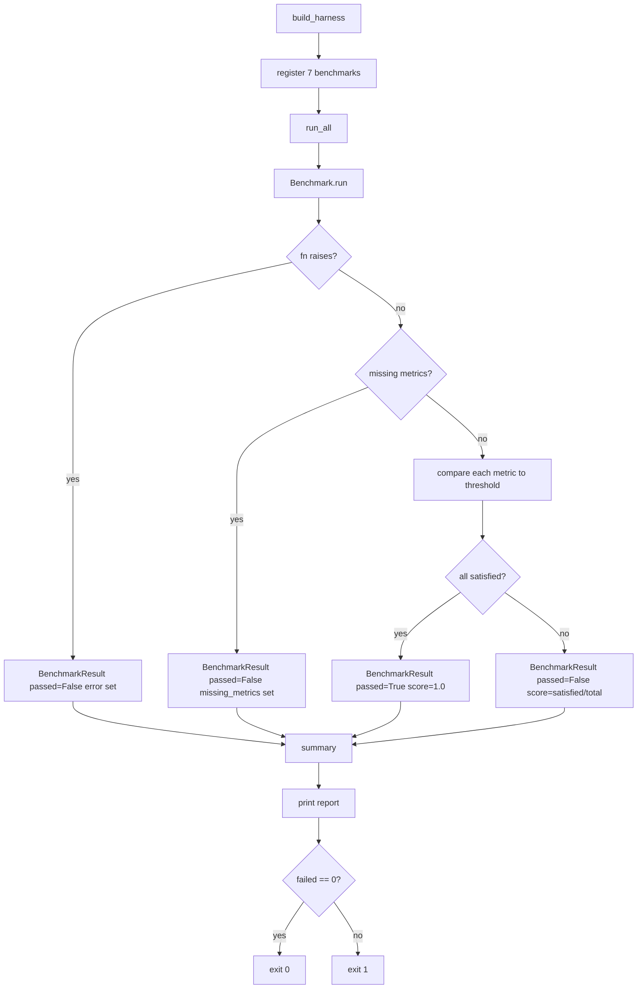

# Evaluation & Evolution Framework

## 1. Purpose

The platform scores itself against **explicit, numeric thresholds** rather than
subjective judgement. Every benchmark measures a real solver on real data and
compares the result to a hard threshold. A benchmark either passes or fails —
there is no "good enough" discretion. This makes quality claims falsifiable:
anyone can run the suite and verify the same verdicts.

The framework exists so that:

- **Regressions are caught mechanically.** A solver that degrades below its
  threshold fails the suite; no human review is needed to notice.
- **Improvements are tracked across generations.** `EvolutionTracker` records
  scores over successive versions, so progress (or backsliding) is visible as
  a trend, not a one-off snapshot.
- **The platform's own measuring instruments are themselves benchmarked.**
  The `evaluation_framework` benchmark verifies that `Metric`, `Benchmark`,
  and `EvolutionTracker` behave correctly — the ruler is calibrated.

## 2. Core Primitives

All primitives live in `src/precision_health_os/evaluation/__init__.py`.

| Primitive | Role | Key methods / fields |
|---|---|---|
| `Metric` | A single measured quantity with a direction of goodness. | `name`, `value`, `unit`, `higher_is_better`; `better_than(other)`, `to_dict()` |
| `Benchmark` | A named, runnable measurement checked against pass thresholds. | `name`, `fn`, `thresholds`, `lower_is_better`; `run() → BenchmarkResult` |
| `BenchmarkResult` | Outcome of running one benchmark. | `benchmark_name`, `metrics`, `thresholds`, `passed`, `score`, `missing_metrics`, `error`; `to_dict()` |
| `EvaluationHarness` | Registers benchmarks and runs them as an ordered suite. | `register(benchmark)`, `run_all() → list[BenchmarkResult]`, `summary() → dict` |
| `EvolutionTracker` | Tracks a metric's movement across generations of improvement. | `record(generation, score)`, `history()`, `best_generation()`, `best_score()`, `improvement()`, `is_improving()`, `regressed()` |

### How `Benchmark.run()` works

1. Call `fn()` to get a `{metric_name: value}` mapping.
2. If `fn()` raises, return a failed `BenchmarkResult` with `error` set —
   one broken benchmark does not abort the suite.
3. If a required threshold metric is missing from the result, return a
   failed `BenchmarkResult` with `missing_metrics` populated.
4. Otherwise, compare each metric to its threshold. Metrics listed in
   `lower_is_better` must be **at or below** the threshold; all others must
   be **at or above** it.
5. `score = satisfied / total`. `passed = (satisfied == total)`.

### How `EvaluationHarness.summary()` works

`summary()` calls `run_all()` and aggregates:

- `total` — number of registered benchmarks.
- `passed` / `failed` — count of passing / failing results.
- `pass_rate` — `passed / total` (0.0 if empty).
- `mean_score` — mean of all `result.score` values.
- `results` — list of `BenchmarkResult.to_dict()` for each benchmark.

## 3. The 7 Benchmarks

All benchmarks are defined in `src/precision_health_os/benchmarks.py` and
registered in `build_harness()`.

| # | Name | What it measures | Threshold(s) | Why it matters clinically |
|---|---|---|---|---|
| 1 | `tsp_quality` | TSP 2-opt solver: monotonicity vs nearest-neighbour baseline, and optimality gap vs brute-force optimum on n=6 instances. | `no_regression_vs_nn ≥ 1.0`, `within_10pct_of_optimal ≥ 0.80` | Route optimisation underpins staff scheduling and sample logistics. A solver that regresses against a trivial NN seed or lands >10% from optimal wastes fuel, time, and cold-chain capacity. |
| 2 | `knapsack_optimality` | Knapsack DP solver: exact match against brute-force optimum on 60 random instances. | `optimality_rate = 1.0` | Resource allocation (e.g. which tests to run under a budget) must be exactly optimal — a sub-optimal pack means a missed test or wasted reagent. |
| 3 | `vrp_feasibility` | VRP with time windows: every node served, vehicle capacity never breached, across 40 random instances. | `all_nodes_served_rate = 1.0`, `capacity_respected_rate = 1.0` | Home-visit nursing and sample collection routes must be feasible. An unserved patient is a missed care event; a capacity breach is a regulatory violation. |
| 4 | `bipartite_correctness` | Patient–trial matching: never pair an ineligible patient, always find an eligible one. | `no_ineligible_matches = 1.0`, `found_an_eligible_patient = 1.0` | Matching an ineligible patient to a clinical trial is a protocol violation with ethical and legal consequences. |
| 5 | `anomaly_detection` | IoT anomaly detector: spike recall on 4 injected spikes, specificity on 20 stationary-noise series. | `spike_recall = 1.0`, `normal_specificity ≥ 0.95` | A missed vital-sign spike is a silent deterioration; a false alarm on normal variation causes alarm fatigue and erodes trust in the monitoring system. |
| 6 | `solver_latency` | Wall-clock time for TSP (25 points) and VRP (30 locations) solvers. | `tsp_ms ≤ 2000.0`, `vrp_ms ≤ 2000.0` (lower is better) | Interactive clinical tools must respond within a usable latency budget. A solver that takes seconds blocks the workflow and delays care decisions. |
| 7 | `evaluation_framework` | The framework's own primitives: `Metric.better_than`, `EvolutionTracker` best/improvement/is_improving. | `framework_correctness = 1.0` | If the measuring instruments are broken, every other benchmark is untrustworthy. This benchmark calibrates the ruler. |

## 4. How to Run

### CLI suite

```bash
python -m precision_health_os.benchmarks
```

This calls `build_harness()`, runs `summary()`, prints a per-benchmark report
with PASS/FAIL, measured values, and thresholds, then prints aggregate
statistics. The process exits **0** when all benchmarks pass and **1** when
any fail.

### Pytest

```bash
pytest tests/evaluation/
```

Three test files cover the framework:

- `test_evaluation.py` — unit tests for `Metric`, `Benchmark`,
  `EvaluationHarness`, and `EvolutionTracker` (written TDD RED before
  implementation).
- `test_benchmarks_suite.py` — imports and executes each benchmark
  function in-process, asserts the harness registers all 7 benchmarks,
  asserts `pass_rate == 1.0` and `mean_score == 1.0`, and asserts
  `main() == 0`.
- `test_benchmark_quality.py` — deeper regression tests for TSP optimality
  and anomaly-detection specificity, encoding the same thresholds as
  pytest assertions.

### Harness run loop



## 5. Evolution Tracking

`EvolutionTracker` records a metric's score across successive generations
(improvement iterations) and answers four questions:

- **What was the best score?** — `best_score()` returns the maximum recorded
  value; `best_generation()` returns the generation that produced it.
- **Is the metric improving monotonically?** — `is_improving()` returns
  `True` only when every successive score is strictly greater than the
  previous one.
- **What is the net change?** — `improvement()` returns
  `last_score - first_score`.
- **Has it regressed?** — `regressed()` returns `True` when the latest
  score is below the best recorded score.

### Worked example

The `evaluation_framework` benchmark exercises `EvolutionTracker` with three
generations:

| Generation | Score |
|---|---|
| 1 | 0.40 |
| 2 | 0.60 |
| 3 | 0.80 |

- `best_generation()` → `3`
- `best_score()` → `0.80`
- `improvement()` → `0.80 - 0.40 = 0.40`
- `is_improving()` → `True` (0.40 < 0.60 < 0.80)
- `regressed()` → `False` (0.80 is not below the best of 0.80)

If a fourth generation scored 0.70, `regressed()` would return `True`
because 0.70 < 0.80, and `is_improving()` would return `False` because the
sequence is no longer monotonically increasing.

## 6. Adding a New Benchmark

Define a function that returns a `{metric_name: value}` mapping, then
register it in `build_harness()`:

```python
def bench_new_solver() -> dict[str, float]:
    """Measure the new solver's correctness rate."""
    random.seed(42)
    correct = 0
    trials = 50
    for _ in range(trials):
        # ... run solver, compare to expected ...
        if got == expected:
            correct += 1
    return {"correctness_rate": correct / trials}


def build_harness() -> EvaluationHarness:
    harness = EvaluationHarness()
    # ... existing registrations ...
    harness.register(
        Benchmark(
            "new_solver_correctness",
            bench_new_solver,
            {"correctness_rate": 0.95},
        )
    )
    return harness
```

The benchmark is automatically included in `run_all()`, `summary()`, and
the CLI report. No other wiring is needed.

## 7. The Quality Ratchet

The platform enforces a **quality ratchet**: a set of gates that must pass
before the codebase is considered healthy. The ratchet only moves forward —
thresholds are raised, never lowered.

| Gate | Threshold | Current status |
|---|---|---|
| Test coverage | ≥ 95% | 98.57% |
| Total tests | — | 516 |
| Benchmark suite | all 7 pass | all 7 green |
| `pass_rate` | = 1.0 | 1.0 |
| `mean_score` | = 1.0 | 1.0 |

The coverage gate of 95% ensures that the vast majority of the codebase is
exercised by tests. The current coverage of 98.57% exceeds that gate. The
516 tests include unit tests for every framework primitive, in-process
execution of all 7 benchmarks, and deeper regression tests for TSP and
anomaly detection. All 7 benchmarks pass with a `pass_rate` of 1.0 and a
`mean_score` of 1.0, meaning every measured metric meets or exceeds its
threshold on every run.
